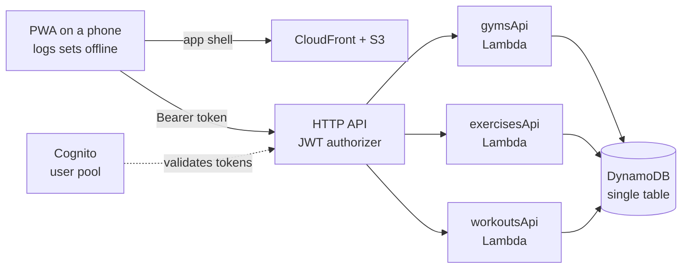
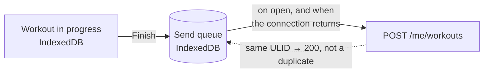
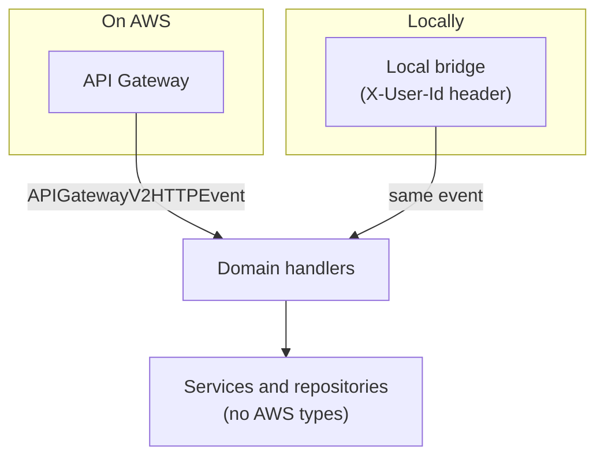

# Etiya

**A gym tracker you can use with one hand, mid-set.** Log your workouts, keep a history, and pay nothing to run it.

[](https://github.com/landoicco/etiya/actions/workflows/ci.yml)
[](https://openjdk.org/projects/jdk/21/)
[](https://react.dev/)
[](https://aws.amazon.com/cdk/)
[](LICENSE)

Two halves. A serverless API in Java and Spring Cloud Function on AWS Lambda, behind an HTTP API with Cognito authentication, storing everything in a single DynamoDB table. And a PWA that installs on a phone and logs sets one-handed, offline, on the gym floor. Both are defined as code in this repo, and the whole thing fits inside the AWS free tier.

> **Etiya** is Nahuatl for [*to become heavy*](https://gdn.iib.unam.mx/diccionario/etiya/25282) — the barbell, not you. Although the dictionary also offers *"to be left without strength"*, which is a fair description of leg day.

## How it works



The app is static files on CloudFront, so there is no server rendering it and nothing to keep warm. One Lambda per domain, all running the same jar and picking their handler from an environment variable. Requests without a valid token are rejected by API Gateway before any code runs. Workouts are stored under their owner, so reading someone else's is not something the API can even express.

The same stack is defined twice: **`EtiyaProd`, which is always up and retains its data, and `EtiyaDev`, disposable and raised only when there is something to try.** What differs between them is what survives a mistake, so a wrong command in development cannot cost anything that matters.

## What's interesting here

**A workout survives a gym with no signal.** Sets are written to IndexedDB as they happen, and finishing a workout queues it rather than sending it. The queue drains when the app opens and whenever the connection returns.



Every request carries a client-generated ULID, so a send that actually went through the first time answers `200` with the stored workout instead of creating a second one. That is what makes retrying safe enough to do blindly.

**The URL says what is on screen, sheets included.** A phone's back gesture is the main way out of anything, so closing a sheet is the same `history.back()` the gesture performs, and there is no second stack of open sheets to keep in step with the browser's. The router is forty lines rather than a dependency.

**The same handlers run locally and on Lambda.** A bridge used only in local builds turns HTTP requests into the API Gateway events the handlers expect, including fake Cognito claims, so the API runs with no AWS account and the integration suite covers both — 38 of its 40 requests run unchanged against either.



**It is not AWS on your machine, and does not try to be.** There is no Cognito, no API Gateway and no Lambda runtime locally, so token validation, CORS, throttling and cold starts are only answered by [running the suite against a deployed stack](docs/testing.md). What the local stack covers is where the bugs actually are, and CI runs it on every pull request with no AWS credentials at all.

**Workout IDs are ULIDs derived from the start time.** Because a ULID begins with its timestamp, sorting IDs sorts by date. One key serves both "open this workout" and "show my history, newest first", with no secondary index and no timezone guessing.

**Cold starts are handled, not ignored.** Spring on Lambda is slow to boot, so SnapStart is enabled and each function is exposed through an alias, since SnapStart only applies to published versions. Warm responses land around 400 ms.

**Every stored item records the shape it was written with.** A `schemaVersion` is stamped from the first production write, because data cannot be versioned retroactively: inspecting attributes can tell an added field from a renamed one, but not a field whose meaning changed while its name and type stayed the same.

**Cost is a design constraint.** Provisioned DynamoDB capacity instead of on-demand (the free tier covers the former), log retention set on purpose, no NAT gateways or KMS keys, and throttling on the API so a flood cannot turn into a bill.

**Every design choice is written down**, including the ones that were rejected and the work that was deliberately postponed: [docs/decisions.md](docs/decisions.md).

## Quick start

With [Nix](https://nixos.org/) installed, no other setup is needed:

```bash
nix develop            # Java 21, Maven, Docker, Bruno, Node.js, AWS + CDK CLIs
docker compose up --build
```

The API answers at `http://localhost:8080`. There is no API Gateway locally, so the user comes from a header:

```bash
curl -H "X-User-Id: user-default" http://localhost:8080/me/workouts
```

Run the integration suite in another terminal:

```bash
cd bruno-tests && bru run --env Local
```

The web app is developed against a deployed stack rather than this one, because signing in is a real Cognito login: [running the web app](docs/local-development.md#running-the-web-app). Deploying your own copy is covered in [the deployment guide](docs/deployment.md).

## Documentation

| Guide | What's in it |
|---|---|
| [Local development](docs/local-development.md) | Docker Compose, the web app, the Nix shells, how identity works locally, building |
| [Deployment](docs/deployment.md) | The two stacks, bootstrap, first Cognito user, cost and abuse limits |
| [API reference](docs/api.md) | Endpoints, conventions, status codes |
| [Data model](docs/data-model.md) | Single table design, slugs, ULIDs, workout times |
| [Testing](docs/testing.md) | Unit tests, Bruno against local and AWS, what CI runs |
| [Decisions](docs/decisions.md) | Why the project looks the way it does, and what is postponed |

## Layout

```
core/         the API (Spring Cloud Function, DynamoDB)
web/          the web app, a PWA (Vite, React, TypeScript, Tailwind)
infra/        infrastructure as code (AWS CDK in Java)
bruno-tests/  integration tests (Bruno CLI)
scripts/      the exercise catalog every new stack is seeded with
docs/         guides and design decisions
flake.nix     the whole toolchain
```

## Built with Claude Code

This project is developed alongside [Claude Code](https://claude.com/claude-code) as a pair-programming partner: options are weighed before any code is written, changes land in small reviewable steps, and the reasoning behind each one ends up in [docs/decisions.md](docs/decisions.md) instead of being lost. Every change is reviewed and committed by a human. The `dev` Nix shell ships the CLI, so the setup is part of the toolchain rather than a personal detail.

## Status and roadmap

Both halves are built and in use. The API covers gyms, exercises and workouts, with authentication, pagination and validation (`api-v0.3.0`). The web app logs a workout end to end — gym, exercises, sets, finish, history — installs on a phone and works without a connection (`web-v0.1.0`). Releases track what each version added.

Next is the first stable release of both, and after it the things the app has already asked for while being used: carrying last session's numbers forward, and cardio logged as time rather than reps. What comes after, and the trigger for each, lives in the [still open](docs/decisions.md#still-open) table.
