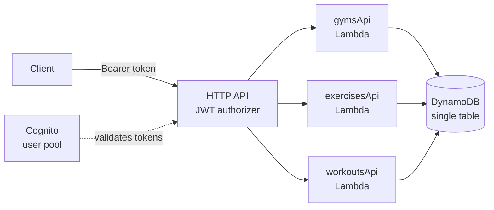
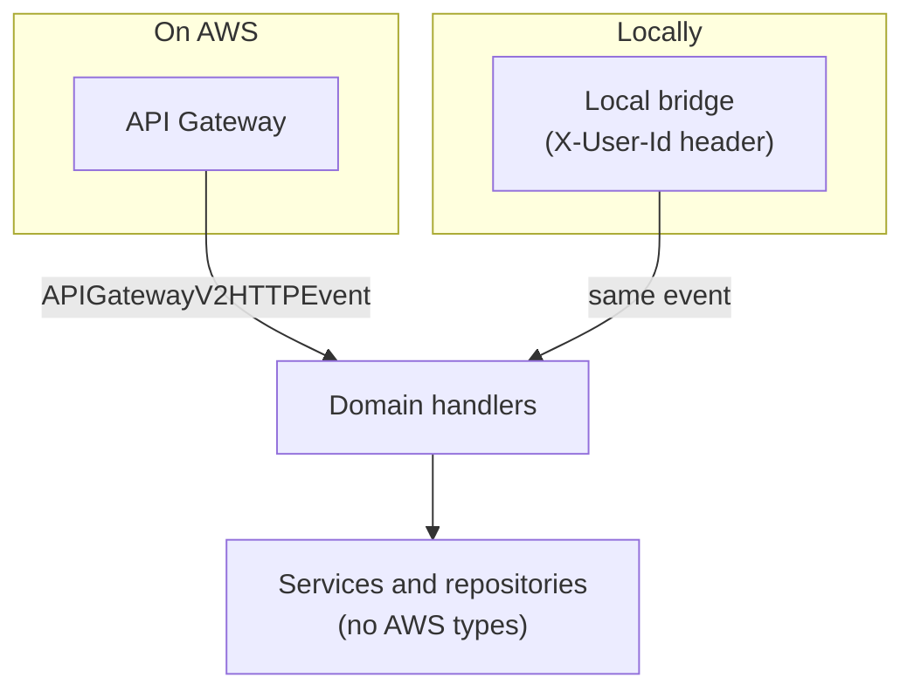

# Etiya

**A serverless gym tracker API.** Log your workouts, keep a history, and pay nothing to run it.

[](https://github.com/landoicco/etiya/actions/workflows/ci.yml)
[](https://openjdk.org/projects/jdk/21/)
[](https://aws.amazon.com/cdk/)
[](LICENSE)

Built with Java and Spring Cloud Function on AWS Lambda, behind an HTTP API with Cognito authentication, storing everything in a single DynamoDB table. The whole thing is defined as code and fits inside the AWS free tier.

> **Etiya** is Nahuatl for [*to become heavy*](https://gdn.iib.unam.mx/diccionario/etiya/25282) — the barbell, not you. Although the dictionary also offers *"to be left without strength"*, which is a fair description of leg day.

## How it works



One Lambda per domain, all running the same jar and picking their handler from an environment variable. Requests without a valid token are rejected by API Gateway before any code runs. Workouts are stored under their owner, so reading someone else's is not something the API can even express.

## What's interesting here

**The same code runs locally and on Lambda.** A bridge used only in local builds turns HTTP requests into the exact events API Gateway would send, including fake Cognito claims. Local development needs no AWS account and no emulator, and the same test suite validates both environments.



**Workout IDs are ULIDs derived from the start time.** Because a ULID begins with its timestamp, sorting IDs sorts by date. One key serves both "open this workout" and "show my history, newest first", with no secondary index and no timezone guessing.

**Cold starts are handled, not ignored.** Spring on Lambda is slow to boot, so SnapStart is enabled and each function is exposed through an alias, since SnapStart only applies to published versions. Warm responses land around 400 ms.

**Cost is a design constraint.** Provisioned DynamoDB capacity instead of on-demand (the free tier covers the former), log retention set on purpose, no NAT gateways or KMS keys, and throttling on the API so a flood cannot turn into a bill.

**Every design choice is written down**, including the ones that were rejected and the work that was deliberately postponed: [docs/decisions.md](docs/decisions.md).

## Quick start

With [Nix](https://nixos.org/) installed, no other setup is needed:

```bash
nix develop            # Java 21, Maven, Docker, Bruno, AWS + CDK CLIs
docker compose up --build
```

The API answers at `http://localhost:8080`. There is no API Gateway locally, so the user comes from a header:

```bash
curl -H "X-User-Id: user-default" http://localhost:8080/me/workouts
```

Run the integration suite in another terminal:

```bash
cd bruno-tests && bru run --env Local
```

Deploying your own copy takes two commands and is covered in [the deployment guide](docs/deployment.md).

## Documentation

| Guide | What's in it |
|---|---|
| [Local development](docs/local-development.md) | Docker Compose, the Nix shells, how identity works locally, building |
| [Deployment](docs/deployment.md) | CDK stack, bootstrap, first Cognito user, cost and abuse limits |
| [API reference](docs/api.md) | Endpoints, conventions, status codes |
| [Data model](docs/data-model.md) | Single table design, slugs, ULIDs, workout times |
| [Testing](docs/testing.md) | Bruno against local and AWS, the `local-only` tag |
| [Decisions](docs/decisions.md) | Why the project looks the way it does, and what is postponed |

## Layout

```
core/         the application (Spring Cloud Function, DynamoDB)
infra/        infrastructure as code (AWS CDK in Java)
bruno-tests/  integration tests (Bruno CLI)
docs/         guides and design decisions
flake.nix     the whole toolchain
```

## Built with Claude Code

This project is developed alongside [Claude Code](https://claude.com/claude-code) as a pair-programming partner: options are weighed before any code is written, changes land in small reviewable steps, and the reasoning behind each one ends up in [docs/decisions.md](docs/decisions.md) instead of being lost. Every change is reviewed and committed by a human. The `dev` Nix shell ships the CLI, so the setup is part of the toolchain rather than a personal detail.

## Status and roadmap

The API is complete and deployed: gyms, exercises and workouts, with authentication, pagination and validation. Releases track what each version added.

What comes next, and the trigger for each, lives in the [still open](docs/decisions.md#still-open) table. The short version: editing and deleting workouts, tighter limits, and a frontend in this same repository.
