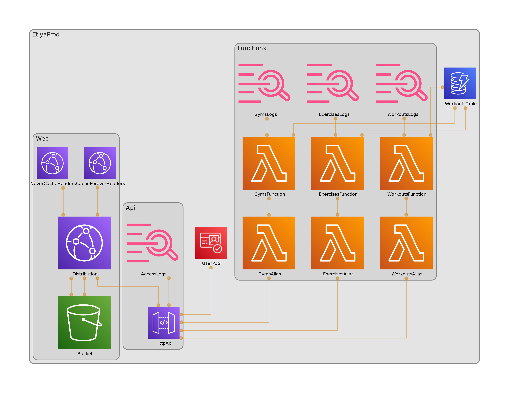

# Deployment (AWS CDK)

*For deploying your own copy to an AWS account, and for understanding what it costs.*

`infra/` is an independent Maven project that defines the infrastructure with the **AWS CDK in Java**:

| Construct | Resources |
|---|---|
| `Database` | DynamoDB table `<stack>-Workouts`, provisioned 5 RCU / 5 WCU |
| `Auth` | Cognito user pool with self sign-up disabled, plus a public app client |
| `Functions` | Three Lambdas (one per domain) with SnapStart, each exposed through a `live` alias |
| `Api` | HTTP API with a Cognito JWT authorizer on every route, CORS, throttling and access logs |
| `Web` | Private S3 bucket and a CloudFront distribution that serves the web app from it |

## Two environments

One stack per environment, and there are two of them:

| | `EtiyaProd` | `EtiyaDev` |
|---|---|---|
| Purpose | Holds real workouts, always up | Raised to try something, destroyed afterwards |
| Table and user pool | `RETAIN`, and the table also refuses `DeleteTable` | `DESTROY` |
| Point-in-time recovery | On | Off |
| `Web` (S3 + CloudFront) | Created | **Not created** |
| Outputs | All six | No `WebUrl` or `WebBucketName` |

Which one a stack is comes from `EtiyaStack.Kind`, passed to the constructs that care. The difference is about what survives a mistake: production is meant to outlive its own stack, while a dev environment that cannot be razed cheaply stops being raised at all.

Dev skips `Web` because it is developed against `npm run dev` on localhost, which the API already allows as a CORS origin. That alone is what makes dev quick to create and destroy: a CloudFront distribution takes about 15 minutes each way, and its bucket has to be emptied by hand first.

> ⚠️ **Always name the stack.** Both are defined in the app, so a bare `cdk deploy` or `cdk destroy` would act on both.

Every synth also runs [cdk-nag](decisions.md#security-rules-checked-on-every-synth) security checks, and fails if a finding is neither fixed nor acknowledged.



That diagram is generated from the CDK code rather than drawn, so it is right by construction — but only as of the last time somebody regenerated it, which belongs with any change to `infra/`:
```bash
cd infra && cdk synth >/dev/null
npx cdk-dia --include EtiyaProd \
  --target-path "$(git rev-parse --show-toplevel)/docs/images/architecture.png"
```
`--include` matters now that there are two stacks: without it `cdk-dia` draws both in one image. `EtiyaProd` is the one worth showing, since dev is the same thing without `Web`.
It reads `cdk.out/tree.json` and needs Graphviz, which the `infra` shell provides. Pass an absolute path: `cdk-dia` mangles relative ones that start with `..`.

## Prerequisites

**AWS credentials.** Either sign in with the console session (temporary credentials, no long-lived keys):
```bash
aws login
aws sts get-caller-identity
```
…or configure an IAM user's access keys with `aws configure --profile etiya` and `export AWS_PROFILE=etiya`.

**Bootstrap**, once per account and region:
```bash
cd infra && cdk bootstrap
```

> On nixpkgs, `aws-cdk-cli` 2.1131.0 does not ship `bootstrap-template.yaml` where the CLI looks for it, so `cdk bootstrap` fails with `ENOENT`. Workaround: point it at the copy that is shipped:
> ```bash
> cdk bootstrap --template "$(dirname "$(readlink -f "$(which cdk)")")/../lib/api/bootstrap/bootstrap-template.yaml"
> ```
> This only affects `bootstrap`, not `synth` or `deploy`.

## Deploying

The Lambda jar is built first, since the CDK packages it as an asset:
```bash
cd core && mvn -P prod clean package -DskipTests
cd ../infra && cdk deploy EtiyaProd
```

`cdk synth` needs no credentials and touches nothing in AWS, so it is a safe way to check both stacks before deploying.

The deploy prints everything needed to use the API:
```
WebUrl           = https://<distribution-id>.cloudfront.net
WebBucketName    = etiyaprod-webbucketxxxxxxxx-xxxxxxxxxxxx
ApiUrl           = https://<api-id>.execute-api.us-east-1.amazonaws.com
UserPoolId       = us-east-1_xxxxxxxxx
UserPoolClientId = xxxxxxxxxxxxxxxxxxxxxxxxxx
TableName        = EtiyaProd-Workouts
```

`cdk deploy EtiyaDev` prints the same list without the first two, since dev serves no web app.

The first deploy takes a few minutes: it uploads the jar, publishes the SnapStart snapshots and creates the CloudFront distribution.

## Deploying the web app

`cdk deploy EtiyaProd` creates the bucket and the distribution, but leaves the bucket empty. The app is uploaded separately, and every UI change takes seconds without going through CloudFormation:
```bash
cd web && npm run deploy
```

[`web/scripts/deploy.sh`](../web/scripts/deploy.sh) reads the outputs of the stack, builds the app, writes `dist/config.json` with the API URL and the Cognito IDs, and syncs `dist/` to the bucket. The app is then at `WebUrl`.

`STACK` selects the stack for this and for `npm run config`, and **defaults to `EtiyaProd`**, the only one with a bucket to upload to. To point a local `npm run dev` at the dev API instead, write its config explicitly:
```bash
cd web && STACK=EtiyaDev npm run config
```

* `config.json` is written after the build, so the same build works for any stack and none of those values is committed.
* Files under `assets/` have a content hash in their name and are cached for a year. Everything else, including `index.html`, the service worker and `config.json`, is never cached, so a deploy reaches the phones on their next launch and no CloudFront invalidation is needed.
* `assets/` is uploaded first, so a phone that fetches the new `index.html` mid-upload finds every file it points to. Old hashed files are not deleted, for phones still running the previous build.

## Creating the first user

Users cannot sign themselves up, so an administrator creates them:
```bash
aws cognito-idp admin-create-user --user-pool-id <POOL_ID> \
  --username you@example.com --message-action SUPPRESS

aws cognito-idp admin-set-user-password --user-pool-id <POOL_ID> \
  --username you@example.com --password '<PASSWORD>' --permanent
```

* The password needs at least 8 characters, with uppercase, lowercase, a digit and a symbol.
* `--message-action SUPPRESS` skips the invitation email. The address is never contacted, so it does not need to be real.
* `--permanent` matters: without it the user stays in `FORCE_CHANGE_PASSWORD` and login returns a challenge instead of tokens.

The `sub` claim of that user is the ID the API stores as the owner of their workouts:
```bash
aws cognito-idp admin-get-user --user-pool-id <POOL_ID> --username you@example.com \
  --query 'UserAttributes[?Name==`sub`].Value' --output text
```

## Seeding the exercise catalog

A new stack starts with an empty catalog. [`scripts/seed-catalog.mjs`](../scripts/seed-catalog.mjs) registers the common exercises listed in [`scripts/exercises.json`](../scripts/exercises.json), each with its muscle group and category, through the API:
```bash
node scripts/seed-catalog.mjs
```
It signs in as `ETIYA_USERNAME` / `ETIYA_PASSWORD` and reads the stack outputs, so it needs AWS credentials; `STACK` selects the stack and defaults to `EtiyaProd`. Every new environment needs this run once. It is safe to run again: an exercise that already exists gets `409` and is skipped, and nothing stored is changed. To add exercises for everyone, add them to the JSON and run it again.

The credentials come from `.env.<stack>` when that file exists, and from the environment otherwise. Dev keeps a file (`.env.EtiyaDev`, git-ignored, see [testing](testing.md)); **production does not**, because a real account's password does not belong in a file. Export it for the one command that needs it, without putting it in the shell's history:
```bash
read -rsp "Password: " ETIYA_PASSWORD && export ETIYA_PASSWORD
export ETIYA_USERNAME=you@example.com
node scripts/seed-catalog.mjs
unset ETIYA_PASSWORD
```

Any account works: the catalog records nothing about who created an entry, and seeding registers no workouts, so using a real account leaves nothing behind in that account's history.

Gyms are not seeded: users add their own from the app, and the catalog is shared, see [decisions](decisions.md#server-generated-ids-and-409-on-duplicates).

## Tearing it down

Only `EtiyaDev` is meant to be torn down, and it owns no bucket, so nothing has to be emptied first:
```bash
cd infra && cdk destroy EtiyaDev
```
Its table, user pool and log groups use `RemovalPolicy.DESTROY`, so nothing is left behind and nothing keeps costing money. Raising it again is three manual steps, because a new stack means a new user pool: create the dev users, refresh the API URL and `sub` in `bruno-tests/environments/Dev.bru`, and reseed the catalog.

`EtiyaProd` resists the same command on purpose: the table has deletion protection and both it and the user pool are `RETAIN`, so a destroy would fail on the table and, if forced, would leave the data and the accounts behind rather than delete them. Removing production for real means turning deletion protection off by hand first — which is the point.

> If a stack ever does own a bucket that CloudFormation refuses to delete, empty it first with `aws s3 rm "s3://<WebBucketName>" --recursive` and run the destroy again.

## Cost

Everything here fits the AWS free tier, with three exceptions worth knowing about:

| Service | Situation |
|---|---|
| Lambda | 1M requests and 400k GB-s per month, always free. **SnapStart costs nothing extra for Java** |
| DynamoDB | The always-free 25 RCU / 25 WCU apply to *provisioned* capacity, which is why the table is provisioned rather than on-demand |
| DynamoDB backups | ⚠️ Point-in-time recovery is not free: $0.20 per GB-month of table size. A personal workout history weighs a few MB, so this is a fraction of a cent. Only `EtiyaProd` pays it |
| Cognito | Free monthly active users far above what this project needs |
| CloudWatch Logs | 5 GB per month; log groups, including the API access logs, keep 14 days, since the default is to keep them forever |
| HTTP API | ⚠️ ~$1 per million requests. Its free tier only lasts 12 months |
| S3 (CDK assets) | ⚠️ Each deploy uploads the ~52 MB jar. Cents per month, but old assets accumulate |
| CloudFront | 1 TB of transfer and 10M requests per month, always free. Cache and header policies, Origin Access Control and error pages cost nothing. No invalidations are used |
| S3 (web bucket) | ⚠️ Not in the always-free tier: a few hundred KB per build, plus one GET per app launch for the uncached files. A fraction of a cent per month |

Deliberately avoided: NAT gateways, customer-managed KMS keys, Secrets Manager, WAF, Lambda@Edge and a custom domain.

## Abuse and limits

* Every route requires a valid Cognito token, and API Gateway answers `401` **before invoking any Lambda**, so unauthorized traffic costs no Lambda time. It still shows up in the access logs, with the source IP and the reason for the rejection.
* Self sign-up is disabled, so knowing the URL is not enough to get an account.
* The default stage throttles at 10 requests per second with a burst of 20.
* **Honest limitation:** API Gateway bills for every request it receives, including the ones it rejects. A sustained flood at the throttle limit would cost real money, so the API URL is not published in this repo and a budget alarm is the safety net.
* Still open: reserved concurrency per Lambda and a lower throttle. See [decisions](decisions.md#still-open).
